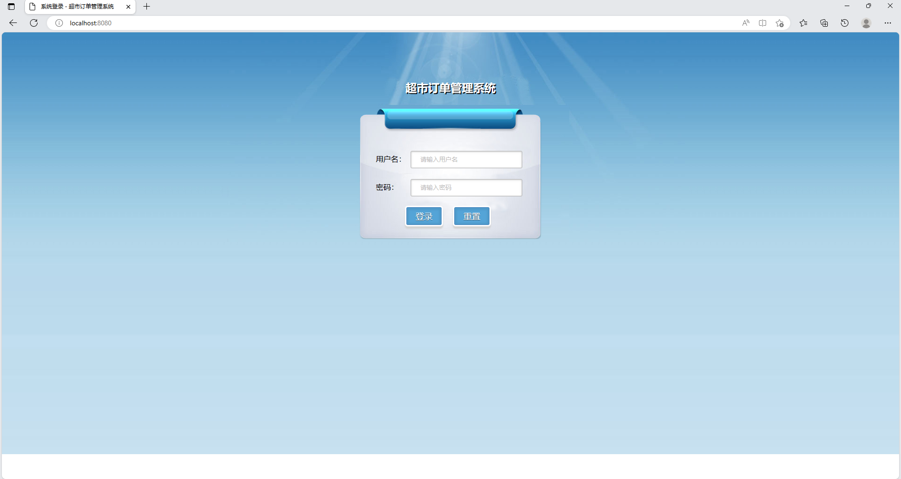
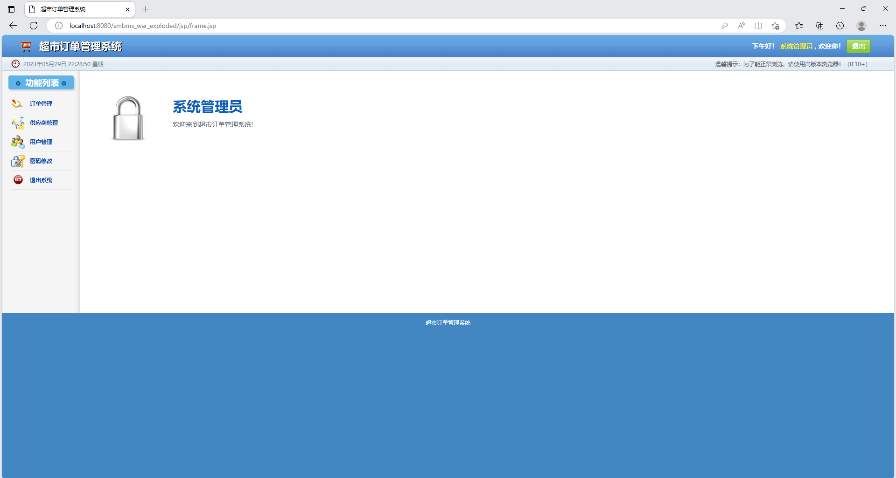
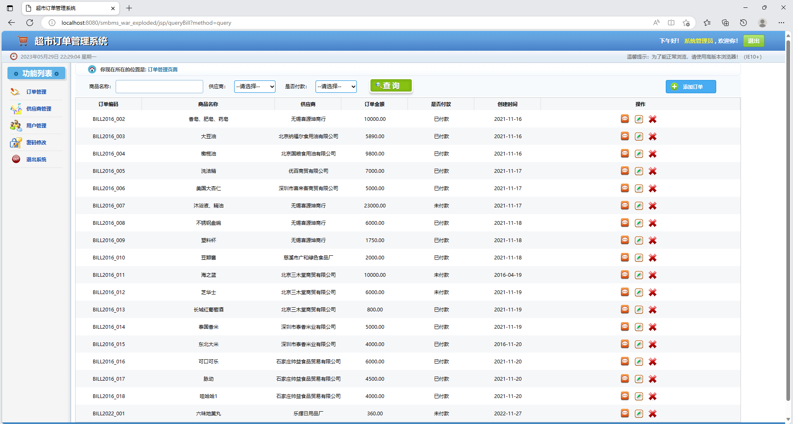
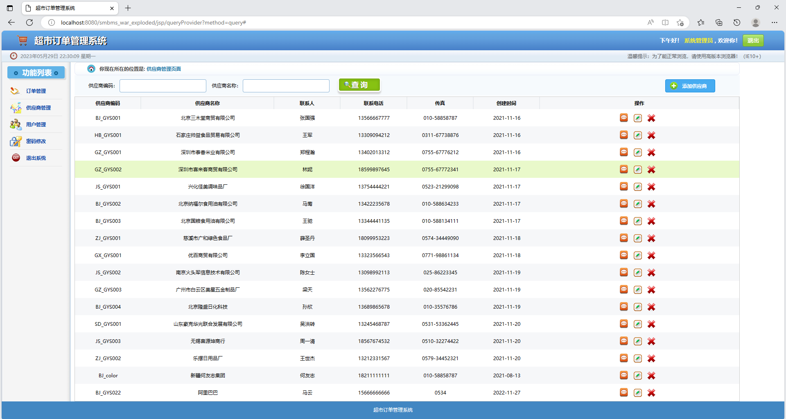

# 超市订单管理系统
### 9.9￥ 获取完整源码+sql，需要加Q：3577148218 ,备用Q: 3808981644
### 有问题，或者需要协助调试运行项目的也可联系
 
### 更多项目： https://github.com/34426?tab=repositories

ssm超市订单管理系统  ssm框架  java

主要功能有：订单管理，供应商管理，用户管理，密码修改等功能；
技术栈：spring，springmvc，mybatis，maven，tomcat，mysql，jsp等
推荐配置：idea，mysql8.0，tomcat8.0

三个用户角色：1、系统管理员 2、经理 3、普通员工

## 系统部分功能页面展示

### 9.9￥ 获取完整源码+sql，需要加Q：3577148218 ,备用Q: 3808981644
### 有问题，或者需要协助调试运行项目的也可联系

